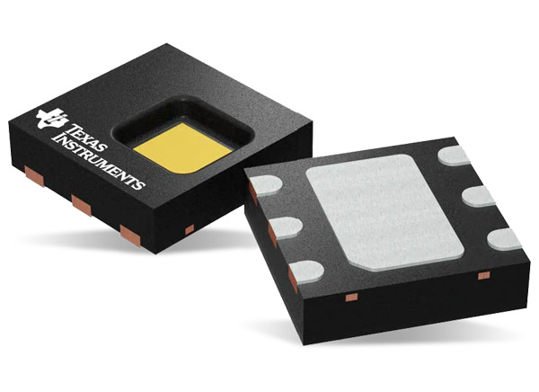

# [Texas Instrument HDC1080](https://www.ti.com/product/HDC1080)
Texas Instruments HDC1080 sensor Low-power High Accuracy humidity and temperature sensor 

  

This driver is written by inspiring from [ClosedCube HDC1080 library](https://github.com/closedcube/ClosedCube_HDC1080_Arduino). 

## New Feature
- can be initialize using a custom TWI interface.
